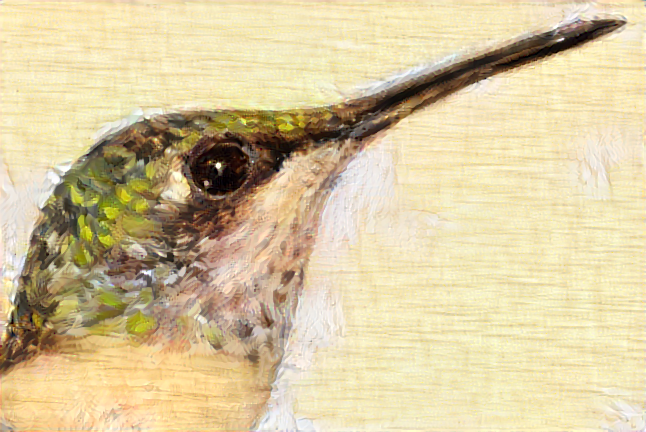

## This repo is an extension of the neural-style repo. The original documentation: 
### Implementing of a Neural Algorithm of Artistic Style ###

This is an implementation of the "[A Neural Algorithm of Artistic Style](http://arxiv.org/abs/1508.06576)". This uses the selected filtered responses of a pre-trained model (VGG-19) to capture low level to high level features and transfer them to the content image.

### How to run

You will need to install dependencies:

- TensorFlow
- Scipy
- Numpy

You will need to download the [VGG-19 model](http://www.vlfeat.org/matconvnet/models/imagenet-vgg-verydeep-19.mat).

Then just run <code>art.py</code>.

References:
- [A Neural Algorithm of Artistic Style](http://arxiv.org/abs/1508.06576)
- [https://github.com/jcjohnson/neural-style](https://github.com/jcjohnson/neural-style)
- [https://github.com/ckmarkoh/neuralart_tensorflow](https://github.com/ckmarkoh/neuralart_tensorflow)

## extension to <code>TensorFlowDemo.py</code>:

### vanilla neural style transfer

Input style image (a scan of a panel painting):

Input content image (a photo):

Output image:

Parameters: 
- <code>lr : 1.0 </code>
- <code>NOISE_RATIO: .2</code>
- <code>STYLE_LAYERS = [
    ('conv1_1', .2),
    ('conv2_1', .2),
    ('conv3_1', .2),
    ('conv4_1', .2),
    ('conv5_1', .2),
]</code>
- <code>ALPHA : 1, BETA : 5</code> default, weight for <code>tv_loss: 1.0e-3</code>

result: run for 6000 iterations and the total loss decreases from 1.46e08 to 1.13e05.

### Add-ons:

### Binary Regression on network coefficients 

different regression models:

- Weights_individual,
  lr : 4e-6

- Weights_covariance,
  lr : 5e-5
